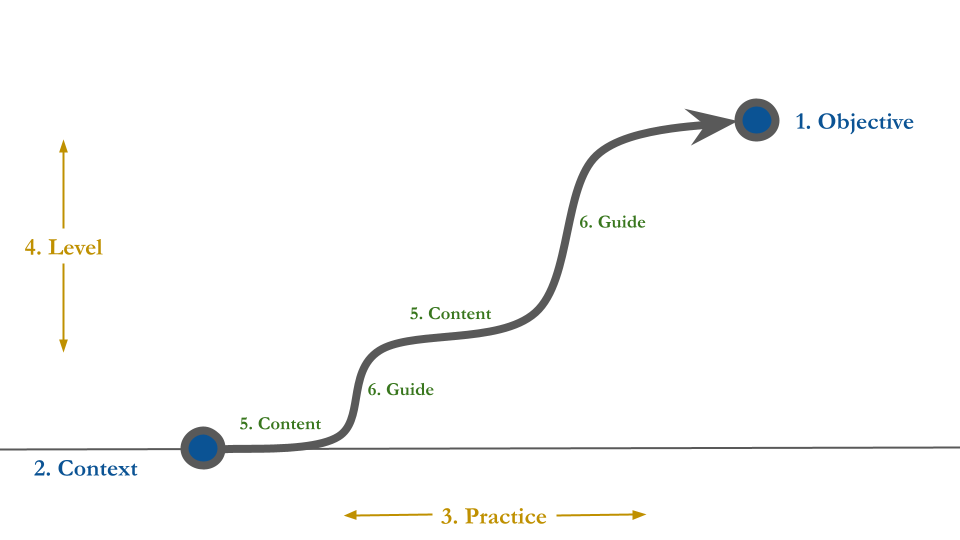
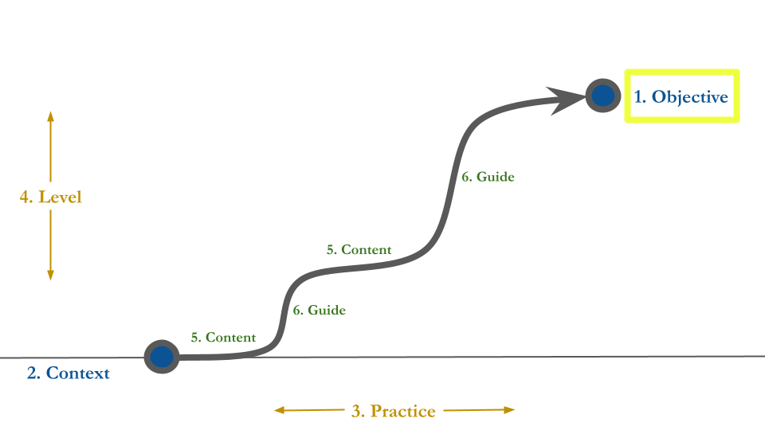
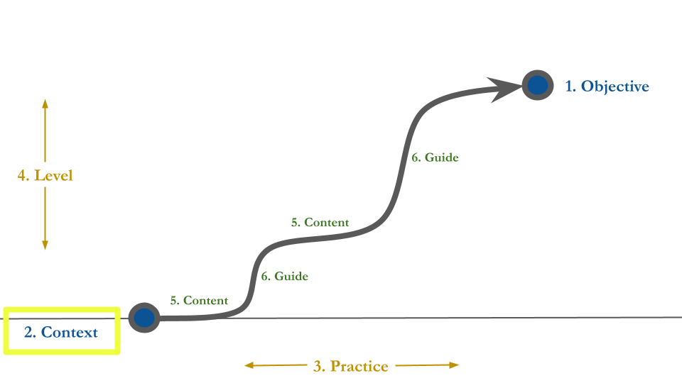
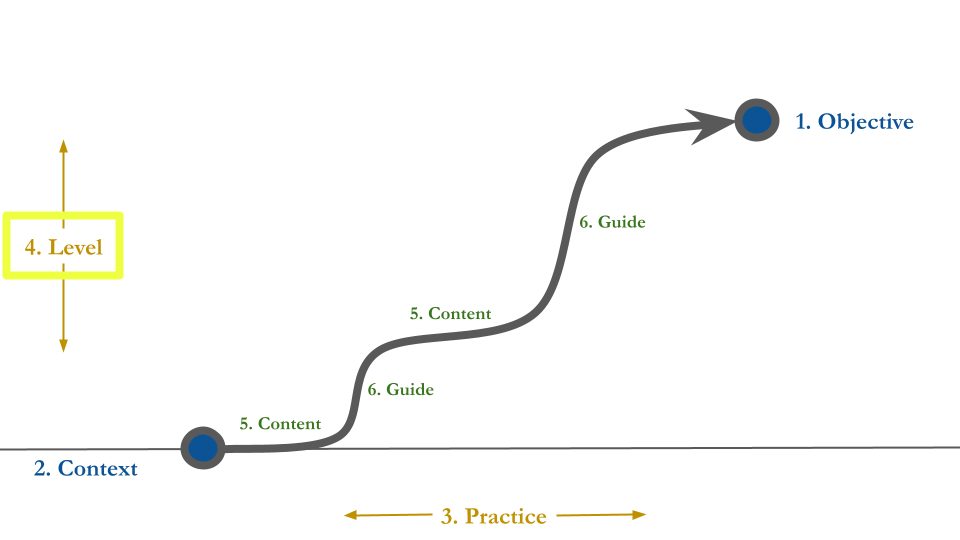
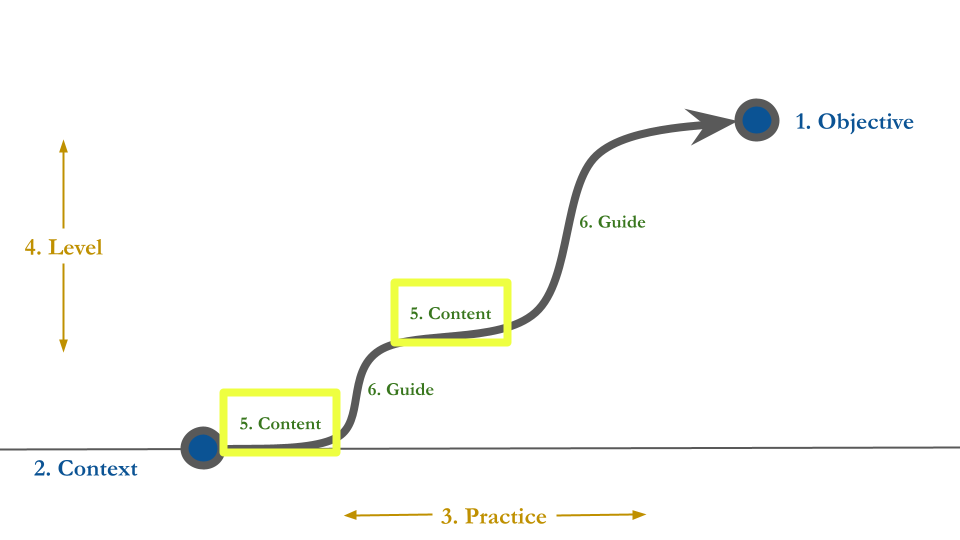
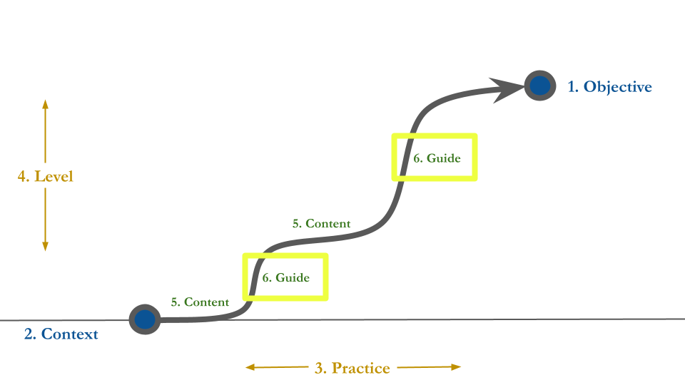

```{r setup, include=FALSE}
usethis::use_git_ignore(c("*.csv", "*.rds"))
options(htmltools.dir.version = FALSE)

library(knitr)
library(tidyverse)
library(xaringan)
library(fontawesome)
```

class: inverse, center, middle

# `r fa("fas fa-images", fill = "#fff")`

**View the slides:** 

[bretsw.com/sdl25](https://bretsw.com/sdl25/)


---

class: inverse, center, middle

# `r fa("fas fa-file-lines", fill = "#fff")`

[Preprint paper available](sdl25-preprint.pdf)

---

class: inverse, center, middle

# `r fa("far fa-compass", fill = "#fff")` <br><br> Introduction

---

# `r fa("far fa-compass", fill = "#fff")` Beginning Teachers

```{r, out.width = "680px", echo = FALSE, fig.align = "center"}
include_graphics("img/game-dev.png")
```

--

Teaching is hard at any career stage

--

but especially starting.

---

# `r fa("far fa-compass", fill = "#fff")` Beginning Teachers

```{r, out.width = "680px", echo = FALSE, fig.align = "center"}
include_graphics("img/game-dev.png")
```

Social media tools offer new opportunities for beginning teachers

--

but also introduce new challenges.

---

# `r fa("far fa-compass", fill = "#fff")` Beginning Teachers

```{r, out.width = "680px", echo = FALSE, fig.align = "center"}

```

Beginning teachers must juggle more competing voices 

--

and for ongoing learning of what and how to teach.

---

# `r fa("far fa-compass", fill = "#fff")` Beginning Teachers

```{r, out.width = "320px", echo = FALSE, fig.align = "center"}
include_graphics("img/stress.jpg")
```

Professional development can't keep up,

--

so self-directed learning is more important than ever.

---

class: inverse, center, middle

# `r fa("fas fa-arrows-left-right-to-line", fill = "#fff")` <br><br> Gap

---

# `r fa("fas fa-arrows-left-right-to-line", fill = "#fff")` Gap

```{r, out.width = "680px", echo = FALSE, fig.align = "center"}
include_graphics("img/puzzle-gap.jpg")
```

--

Unclear how self-directed learning through social media 

--

impacts instructional practice

---

class: inverse, center, middle

# `r fa("fas fa-mountain-sun", fill = "#fff")` <br><br> Framework

---

class: inverse, center, middle

# `r fa("fas fa-mountain-sun", fill = "#fff")` <br><br> Context-Aware Self-Teaching <br> (CAST)

---

# `r fa("fas fa-mountain-sun", fill = "#fff")` Context-Aware Self-Teaching

```{r, out.width = "100%", echo = FALSE, fig.align = "center"}
include_graphics("img/SDL.png")
```

--

### SDL as a Journey

---

# `r fa("fas fa-mountain-sun", fill = "#fff")` Context-Aware Self-Teaching

```{r, out.width = "100%", echo = FALSE, fig.align = "center"}

```

### SDL as a Journey

---

# `r fa("fas fa-mountain-sun", fill = "#fff")` Context-Aware Self-Teaching

```{r, out.width = "100%", echo = FALSE, fig.align = "center"}

```

### SDL as a Journey: **1. Performance Objective**

---

# `r fa("fas fa-mountain-sun", fill = "#fff")` Context-Aware Self-Teaching

```{r, out.width = "100%", echo = FALSE, fig.align = "center"}

```

### SDL as a Journey: **2. Starting Context**

---

# `r fa("fas fa-mountain-sun", fill = "#fff")` Context-Aware Self-Teaching

```{r, out.width = "100%", echo = FALSE, fig.align = "center"}

```

### SDL as a Journey: **3. Practice Opportunities**

---

# `r fa("fas fa-mountain-sun", fill = "#fff")` Context-Aware Self-Teaching

```{r, out.width = "100%", echo = FALSE, fig.align = "center"}

```

### SDL as a Journey: **4. Difficulty Level**

---

# `r fa("fas fa-mountain-sun", fill = "#fff")` Context-Aware Self-Teaching

```{r, out.width = "100%", echo = FALSE, fig.align = "center"}

```

### SDL as a Journey: **5. Content Area**

---

# `r fa("fas fa-mountain-sun", fill = "#fff")` Context-Aware Self-Teaching

```{r, out.width = "100%", echo = FALSE, fig.align = "center"}

```

### SDL as a Journey: **6. External Guide**

---

# `r fa("fas fa-mountain-sun", fill = "#fff")` Context-Aware Self-Teaching

1. `r fa("far fa-circle-dot", fill = "#782F40")` Performance Objective

2. `r fa("fas fa-house-user", fill = "#782F40")` Starting Context

3. `r fa("fas fa-person-walking", fill = "#782F40")` Practice Opportunities

4. `r fa("fas fa-gauge-high", fill = "#782F40")` Difficulty Level

5. `r fa("fas fa-cubes-stacked", fill = "#782F40")` Content Area

6. `r fa("fas fa-people-arrows", fill = "#782F40")` External Guide

---

class: inverse, center, middle

# `r fa("fas fa-compass", fill = "#fff")` <br><br> Purpose

---

# `r fa("fas fa-compass", fill = "#fff")` Purpose

```{r, out.width = "680px", echo = FALSE, fig.align = "center"}
include_graphics("img/game-dev.png")
```

--

Explore how beginning science teachers

--

seek SDL through social media

---

# `r fa("fas fa-compass", fill = "#fff")` Purpose

```{r, out.width = "680px", echo = FALSE, fig.align = "center"}
include_graphics("img/game-dev.png")
```

**RQ1.** What social media sources for SDL?

--

**RQ2.** What effect does SDL through social media have on instructional practice?


---

class: inverse, center, middle

# `r fa("fas fa-screwdriver-wrench", fill = "#fff")` <br><br> Method

---

# `r fa("fas fa-screwdriver-wrench", fill = "#fff")` Method

```{r, out.width = "600px", echo = FALSE, fig.align = "center"}

```

**Design:**

--

Qualitative Multiple Case Study

---

# `r fa("fas fa-screwdriver-wrench", fill = "#fff")` Method

```{r, out.width = "360px", echo = FALSE, fig.align = "center"}
include_graphics("img/game-dev.png")
```

**Participants:**

--

- FSU alumni (*n* = 5)

--

- Science teachers in Florida (across middle and high school)

--

- First or second year of teaching

--

- Active social media users

---

# `r fa("fas fa-screwdriver-wrench", fill = "#fff")` Method

```{r, out.width = "480px", echo = FALSE, fig.align = "center"}
include_graphics("img/writing.jpg")
```

**Data Collection:** (March to May 2022)

--

- 8 weeks of **diary entries** reflecting upon social media use

--

- Pre- and post-**interviews**

--

- 3 **think aloud** demonstrations of lesson plans

---

# `r fa("fas fa-screwdriver-wrench", fill = "#fff")` Method

```{r, out.width = "600px", echo = FALSE, fig.align = "center"}

```

**Data Analysis:**

--

- Thematic analysis of diary entries and interview transcripts

--

- CAST framework + emergent codes

---

class: inverse, center, middle

# `r fa("fas fa-magnifying-glass", fill = "#fff")` <br><br> Results

---

# `r fa("fas fa-magnifying-glass", fill = "#fff")` Results

```{r, out.width = "680px", echo = FALSE, fig.align = "center"}
include_graphics("img/build.jpg")
```

**`r fa("fas fa-triangle-exclamation", fill = "#782F40")` Analysis is still in progress `r fa("fas fa-triangle-exclamation", fill = "#782F40")`**

--

Results presented here represent 2 of the 5 participants

---

# `r fa("fas fa-person-chalkboard", fill = "#fff")` Results

```{r, out.width = "420px", echo = FALSE, fig.align = "center"}
include_graphics("img/game-dev.png")
```

--

**Ginny**

--

- First-year 8th-grade science teacher in a public school

--

- TeachersPayTeachers.com (TPT), TikTok, and YouTube for professional learning

---

# `r fa("fas fa-person-chalkboard", fill = "#fff")` Results

```{r, out.width = "420px", echo = FALSE, fig.align = "center"}
include_graphics("img/game-dev.png")
```

**Sarah**

--

- First-year high school science teacher in a private Catholic school

--

- Facebook and Instagram for professional learning

---

# `r fa("fas fa-person-chalkboard", fill = "#fff")` Results

```{r, out.width = "420px", echo = FALSE, fig.align = "center"}
include_graphics("img/game-dev.png")
```

**Both Ginny and Sarah**

--

- Social aspect of SDL very important, but based in school

--

- Social media tools were a secondary outlet for SDL

--

- Social media tools were for finding resources and ideas for instruction as well as staying updated on what is happening 

---

# `r fa("fas fa-magnifying-glass", fill = "#fff")` Results

```{r, out.width = "600px", echo = FALSE, fig.align = "center"}
include_graphics("img/game-dev.png")
```

--

**RQ1. What social media sources for SDL?**

--

- TeachersPayTeachers.com (TPT), TikTok, YouTube, Facebook, and Instagram

--

- But SDL spanned online and local, with in-school being primary

---

# `r fa("fas fa-magnifying-glass", fill = "#fff")` Results

```{r, out.width = "600px", echo = FALSE, fig.align = "center"}
include_graphics("img/game-dev.png")
```

**Usefulness of SDL through social media:**

--

- Getting the broad perspectives

--

- Efficiently finding ideas and resources 

---

# `r fa("fas fa-magnifying-glass", fill = "#fff")` Results

```{r, out.width = "600px", echo = FALSE, fig.align = "center"}
include_graphics("img/game-dev.png")
```

**Limits of SDL through social media:**

--

- Maintaining social boundaries around social media use

---

# `r fa("fas fa-magnifying-glass", fill = "#fff")` Results

```{r, out.width = "600px", echo = FALSE, fig.align = "center"}
include_graphics("img/game-dev.png")
```

**Limits of SDL through social media:**

- Finding time to locate and adapt resources

---

# `r fa("fas fa-magnifying-glass", fill = "#fff")` Results

```{r, out.width = "600px", echo = FALSE, fig.align = "center"}
include_graphics("img/game-dev.png")
```

**Limits of SDL through social media:**

- Determining quality and relevancy of instructional resources found through social media

---

# `r fa("fas fa-magnifying-glass", fill = "#fff")` Results

```{r, out.width = "600px", echo = FALSE, fig.align = "center"}
include_graphics("img/game-dev.png")
```


**RQ2. What effect on instructional practice?**

--

- More often, **noninstructional** impacts: 

--

  - stress relief, staying informed, prompts for self-reflection

---

# `r fa("fas fa-magnifying-glass", fill = "#fff")` Results

```{r, out.width = "600px", echo = FALSE, fig.align = "center"}
include_graphics("img/game-dev.png")
```


**RQ2. What effect on instructional practice?**

- Some **instructional** impacts: 

--

  - being inspired by and getting resources from other teachers 

--

  - but, generally limited in scope


---

class: inverse, center, middle

# `r fa("fas fa-person-chalkboard", fill = "#fff")` <br><br> Discussion

---

# `r fa("fas fa-person-chalkboard", fill = "#fff")` Discussion

```{r, out.width = "600px", echo = FALSE, fig.align = "center"}
include_graphics("img/SDL.png")
```

--

- Literature describes lots possibilities for SDL through social media,

--

- but this is not evident here.

---

# `r fa("fas fa-person-chalkboard", fill = "#fff")` Discussion

```{r, out.width = "600px", echo = FALSE, fig.align = "center"}
include_graphics("img/SDL.png")
```

- Do they know how? 

--

- Are they interested? 

--

- Do they have capacity?

---

# `r fa("fas fa-person-chalkboard", fill = "#fff")` Discussion

```{r, out.width = "600px", echo = FALSE, fig.align = "center"}
include_graphics("img/SDL.png")
```

- Across 13 chances (8 weeks of diary entries and 5 interviews), SDL through social media was very limited

--

- Getting a few ideas for classroom management, warm-up activities, lesson resources that needed to be modified. 

---

# `r fa("fas fa-person-chalkboard", fill = "#fff")` Discussion

```{r, out.width = "600px", echo = FALSE, fig.align = "center"}
include_graphics("img/SDL.png")
```

- Did not look for mentors, seek out feedback, or test new ideas

--

- Solitary, information-retrieval approach than a community-oriented one

--

- Some affordances of social media were maximized while others were neglected


---

class: inverse, center, middle

# `r fa("fas fa-person-chalkboard", fill = "#fff")` <br><br> Implications

---

# `r fa("fas fa-person-chalkboard", fill = "#fff")` Implications

```{r, out.width = "600px", echo = FALSE, fig.align = "center"}
include_graphics("img/character-builder.png")
```

--

1. SDL is an essential skill for teachers at all career stages

--

2. SDL should be viewed as part of a professional development **ecosystem**

--

3. SDL is a voluntary effort that should be acknowledged and supported

---

# `r fa("fas fa-person-chalkboard", fill = "#fff")` Implications

```{r, out.width = "640px", echo = FALSE, fig.align = "center"}

```

1. SDL is an essential skill for teachers at all career stages

2. SDL should be viewed as part of a professional development **ecosystem**

3. SDL is a voluntary effort that should be acknowledged and supported


---

class: inverse, center, middle

# `r fa("fas fa-person-chalkboard", fill = "#fff")` <br><br> Limitations & <br> Future Research

---

# `r fa("fas fa-person-chalkboard", fill = "#fff")` Limitations

```{r, out.width = "600px", echo = FALSE, fig.align = "center"}

```

--

- Finish data analysis

--

- Include classroom observations and conduct study over longer period 

--

- Conduct design- or intervention-based research to validate the CAST framework


---

class: inverse, center, middle

# `r fa("fas fa-compass", fill = "#fff")` <br><br> Conclusion

---

# `r fa("far fa-compass", fill = "#fff")` Conclusion

```{r, out.width = "720px", echo = FALSE, fig.align = "center"}
include_graphics("img/SDL.png")
```

--

- 

--

- 


---

class: inverse, center, middle

# `r fa("fas fa-question", fill = "#fff")` <br><br> Questions

**What would you like to know more about?**

<hr>

<br><br><br><br>

**Bret Staudt Willet** | Florida State University

`r fa("envelope", fill = "#fff")` [bret.staudtwillet@fsu.edu](mailto:bret.staudtwillet@fsu.edu) | `r fa("globe", fill = "#fff")` [bretsw.com](https://bretsw.com/) | `r fa("fab fa-github", fill = "#fff")` [GitHub](https://github.com/bretsw/)